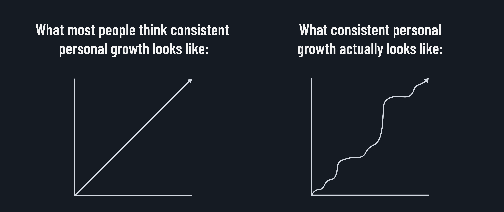

<h1>
  The Programmer's Tools
  Bootcamp Mindset
</h1>

## Harnessing your mindset to succeed

Oftentimes, the biggest obstacle to success is not a lack of technical knowledge but a lack of confidence in your ability to learn and grow. This is especially true in a field like data science, where the pace of change is rapid, and the amount of information you need to know can feel overwhelming. To combat this, you need to develop a growth mindset.

## From fixed to growth mindset

People with a *fixed mindset* believe that their abilities are fixed traits that they were born with and can't change. They believe that:

- They are either good at something or not, and no amount of effort can change that.
- It's better to give up when things get hard to protect their ego or self-image.
- Receiving negative feedback is a mark of intolerable failure.
- The success of others is a threat to their self-worth.
- **"I'm bad at this."**

Eventually, people with a fixed mindset stop showing up.

On the other hand, people with a _growth mindset_ believe that effort leads to learning and growth and that they can develop their abilities through hard work, good strategies, and help from others. They believe that:

- They should seek out feedback because failure is an opportunity to grow.
- They should compare themselves to who they were yesterday.
- The success of others is a vital source of inspiration.
- **"I'm not good at this yet."**

Most importantly, they show up consistently and put in the effort they can.

Most people don't have a purely fixed or growth mindset. Many things someone with a purely fixed mindset would believe are immediately disproven. After all, you weren't born with the ability to read, write, or do math. What you want to strive to do is recognize when you slip into a fixed mindset and work to shift your thinking back to a growth mindset.

This can take practice and requires self-awareness of your emotions and thoughts. When you recognize that you're thinking in a fixed way, challenge those thoughts. When you're avoiding challenges, push yourself to embrace them.

## Team-based mindset

In addition to developing a growth mindset, you'll also need to develop a team-based mindset to succeed. This means that you should be willing to work with others, ask for help when you need it, and offer assistance when you can. Approach others with mutual respect. Be open to different perspectives and ideas.

In a team-based mindset, you recognize you're not alone in your journey. You have peers going through the same challenges and instructors there to help you succeed.

Problem-solving is a team sport. Often, you can solve problems more quickly and effectively when you work with others. You'll also find that you will learn more when you teach others.

Working in a team also promotes a sense of accountability. When you're working with others, you're more likely to show up and put in the effort because you know that others are counting on you.

## Bootcamp mindset -> life mindset

These mindsets are skills that show you're adaptable, resilient, and able to overcome obstacles.

Developing these skills won't just help you succeed in this course - they also help you succeed in life. The ability to learn and grow, work on a team, and approach challenges with a positive attitude are skills that will serve you well in your career, personal relationships, health, and more.

  <h2 class="title">Reflect on your past</h2>
  10 min

This is another exercise that may be a little uncomfortable, but remember, you don't have to share your thoughts with anyone else. This is just for you.

Reflect on a time in your past when you faced a challenge you approached with a fixed mindset that resulted in you giving up. What caused you to have that mindset? Did you recognize it at the time? What would it have taken for you to approach that challenge with a growth mindset instead?

## The end

Well done!  That's the end of the prework, check out the study guides and resurces to keep learning.

