<h1>
  <span class="headline">The Programmer's Tools</span>
  <span class="subhead">Accessing and Navigating the Command Line Interface</span>
</h1>

## Accessing and Navigating the Command Line Interface ( 50 min )

*author: [Mike Dang](https://generalassemb.ly/instructors/mike-dang/5451) : technical sales lead and web development instructor*

----
<br>

Despite what its name implies, the command line interface (CLI) isn’t a group of leaders tasked with enforcing the rules of an intergalactic bureaucracy in the newest superhero movie. It is much more practical than that. Most developers use the CLI for things like navigating the files on their computer. Join us to learn more.


## Topics

- Explain the command line and why developers use it.
- Navigate through your computer’s files structure via the CLI.

## Ooey GUI

When most computer users want to find files on their computers, they use a graphical user interface (GUI). For example, on a Mac, you’d click the Finder icon, while on a Windows computer, you’d select the My Computer icon.

When developers navigate their computers, they tend to use the command line interface — commonly referred to as the “command line,” or “CLI.”

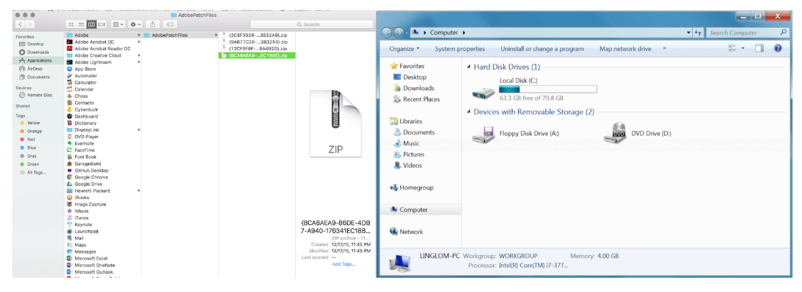

<br>

### **Learning Objectives**

By the end of this lesson, you'll be able to:

- Understand the differences between the CLI and GUI.
- Analyze and categorize key components of a computer's file system, including root and home directories, and explain their significance using real-world analogies.
- Practice using basic commands.
- Write your first command and see your first error.
- Find a file using the command line.

## Why CLI?

You're already familiar with GUIs or Graphical User Interfaces. A GUI lets users interact with programs, files, and settings through visually-driven interactions. The CLI lets users interact with programs, files, and settings through text instead of graphical elements. In essence, the command line is more efficient for developers because it allows them to talk more directly to the computer.

We interact with this interface by typing commands on the command line and then executing them. Everyday tasks you would accomplish from a GUI can also be performed in the CLI. For example, creating, modifying, and deleting files and directories, launching apps, changing application/system settings, and more.

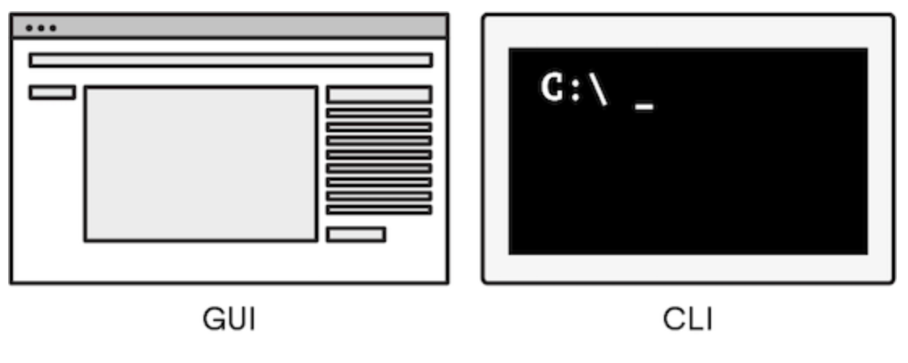

<br>

## Your Wish Is Its Command

Until video display was introduced in the mid-1960s, the command line was the only means of interacting with a computer. Today, the CLI is still preferred by programmers because it’s explicit, fast, and extremely versatile.

We can perform actions using the command line by **entering commands**.

There’s a command to perform virtually any task on your computer.

No, there isn’t a `self destruct` command. No, there isn’t an `eject seat` command. And no, there isn’t a time `travel command`. However, there *are* commands for opening applications, creating new files, and copying files from one place to another — you know, real-life practical stuff.

## From Here On Out

For the rest of this lesson, we’re going to walk through some of the most common commands developers use in the terminal.

We *highly* recommend that you follow along on your own!

If we may offer some more unsolicited advice, we also suggest getting comfortable with a shortcut: `command + tab` on Mac and `alt + tab` on Windows.

This will allow you to quickly toggle between the browser on which you’re viewing this lesson and your CLI.

## Open the Terminal

We access the command line using a *terminal application. Terminal applications act as a user interface for the *shell*, which processes your commands.  How you open your terminal application will depend upon your OS.

On Mac and Linux, this application is called “Terminal.” There are several terminal applications for Windows, such as “PowerShell” and “Command Prompt,” but we will be using a tool called “Git Bash”. To access the terminal application:

- On a Mac, press `⌘ command + space` to bring up the spotlight search. Type in “terminal” and press `return`.
- Use your system search to launch the Windows Terminal application in Windows 10 or the Terminal application in Windows 11. Despite the difference in names, a search for Terminal should work on either OS.  We will be using Bit Bash eventually, try to go to the start menu, type “Git Bash” into the search, then open the application. If that doesn’t work, visit the [Git website](https://git-scm.com/downloads/win) and click “Windows.”

### Home Directory

In programming speak, all folders are called **directories**. A directory within another directory is called a **subdirectory**. A directory that contains a subdirectory is called a **parent directory**.

By default, our terminal starts in what is referred to as the **home directory**.

- For Mac, it is `/Users/yourname/`.
- For Windows, it is `c:\users\yourname`.
- For Linux, it is `/home/yourname`.

Mac users:

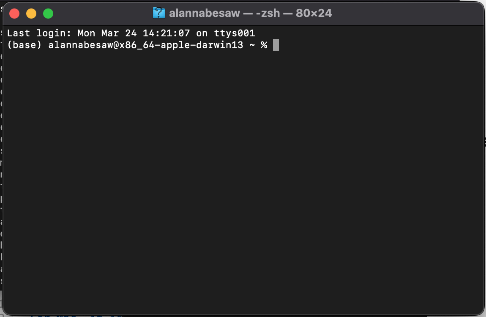

<br>

Windows users:

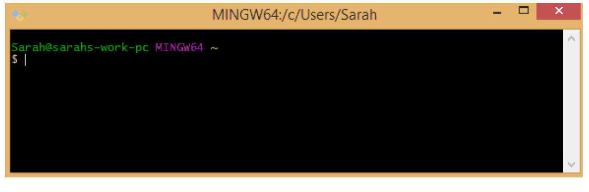

<br>

## Breaking This Down

The terminal window is where you’ll tell the computer what to do and where the computer will display its reply.

This might be the first time you’re seeing this window, so let’s break it down:

- The **prompt** is the `%` for mac and `$` for windows that automatically shows up at the end of the first line. It’s the command line equivalent of “standby” and indicates that the terminal is ready to accept your **command**.  Note that screenshots below are from a Mac with 'Oh My Zsh', so the prompt for that is `~`.
- The **cursor** follows the prompt. This is where the text you type will appear, just like in any other setting in which you’ve seen a cursor.
- The **username** of the person logged in precedes the prompt.


### Your first command

- Write your first command and see your first error.

<a href="https://generalassembly.wistia.com/medias/jgwe4s75fw"></a>

Since the computer is ready to receive input, let's type in a command:

`whoami`

Notice that we have control over when this command is executed. If you make a typo, there's still time to go back and fix it. Use your keyboard's arrow keys for this though; clicking with the mouse doesn't work here!

No typos? All ready to run this? Hit Enter!

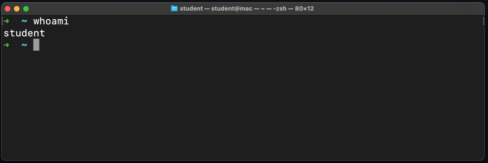

<br>

See something familiar?  This command has a simple job - print the username of the user that runs this command. In the screenshot above, the username is student. Yours will likely be different!

After that command finished executing, we were greeted by the prompt once again, and we're free to type more commands!

Let's try an invalid command, just to see what happens:

`blahblah`

Again, after you've typed this in, hit `Enter` to execute it.

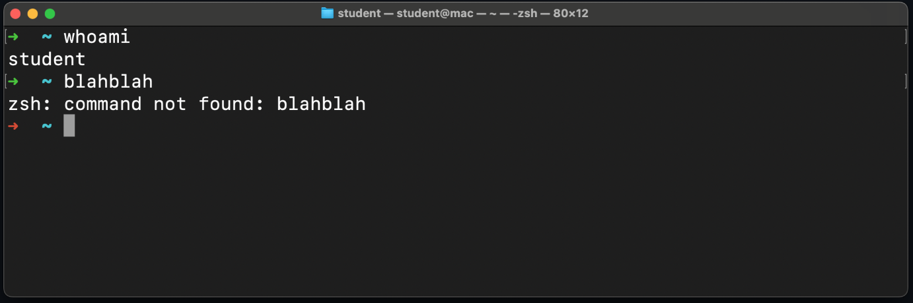

<br>

Our first error! And it's pretty self-explanatory - `zsh: command not found: blahblah`.

We purposefully ran a command we knew was invalid, so it makes sense that it wasn't found. When you see this error, you're trying to run an invalid command!

- 🧠 Notice that the arrow ➜ at the start of the line means we are back at a prompt. So the last command we ran failed in some way; we can still write and execute commands on this line.

# The File System

Analyze and categorize key components of a computer's file system, including root and home directories, and explain their significance using real-world analogies.

## What is the file system?

Before navigating the file system, we should understand what it is. The file system is the organizational structure of a computer.

Just as products in a store are organized by their broadest categories, then divided into sections with aisles full of shelves holding individual products, the files on a computer are organized into directories (also commonly called folders in a GUI).

Imagine you were finding a can of soup at a store. You would start in the store, go to the grocery section, find the canned goods aisle, look for soup, and then find the specific one you want.

Suppose we visualized this:


<br>

There is a clear path to our soup! What if we added some other parts of a store to our example?

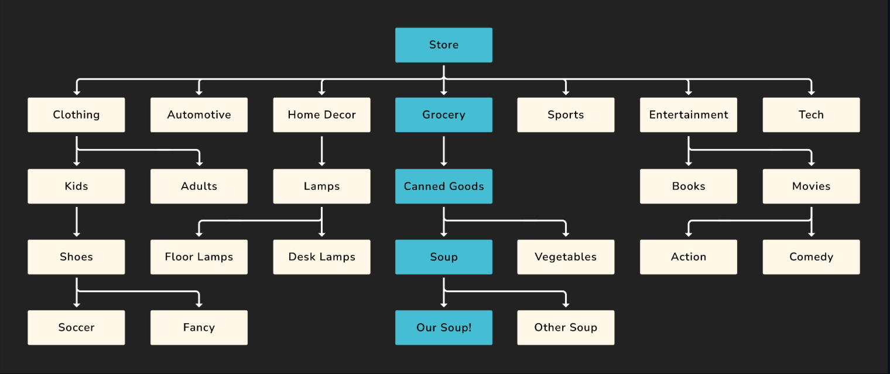

<br>

The path from the store to our specific soup is still highlighted, but we've added some other parts of the store to this diagram. Enough about soup; what does this have to do with a file system?

A file system on a computer follows a lot of the same patterns. Imagine you were finding some music you made on your computer.

You'd start in the *root* directory - `/`. This directory holds all the other directories and files. It's like the store in our example. Then, you'd move into the Users directory. From here, move to your specific user directory (the *user root* or *home* directory). Finally, you'd move into your *Music* directory, where you would find your important music!

Another visual for you:


<br>

Above, you can see the path to the beats file visualized. The word path, or more accurately, *absolute path*, actually has a meaning in this context - it's the unique location for every file or directory in the file system. Each directory in the path is followed by a `/`. The *absolute path* for the beats file is:

`/Users/student/Music/beats`

- 📚 The *root* directory is denoted by a single forward slash (`/`) in Unix-based systems. It is the top-level directory in a file system hierarchy. It is the starting point for the entire file system, and all other directories and files are organized inside it.

- The *home* directory is the personal directory assigned to each user on a system. The home directory is the default location where user-specific configuration files, personal documents, and other data are stored. There's a shorthand for this directory: `~`.

- The *absolute path* to a file is where the file is located from the perspective of the *root* directory.


# Basic Commands

## The Basics

Here is a list commands we will learn:

```
pwd
ls
cd
mkdir
touch
rm
rmdir
```

## Print Working Directory

The `pwd` command stands for “print working directory.” It’s the command equivalent to asking, “Where am I?”

Just like the Finder on a Mac, your CLI places you in a particular directory on your computer. `pwd` tells you where you’re currently located within your file system.


The `~` we see in the prompt on the command line example below is shorthand for the current user's home directory. This command will confirm that. Write and execute this command now:

`pwd`

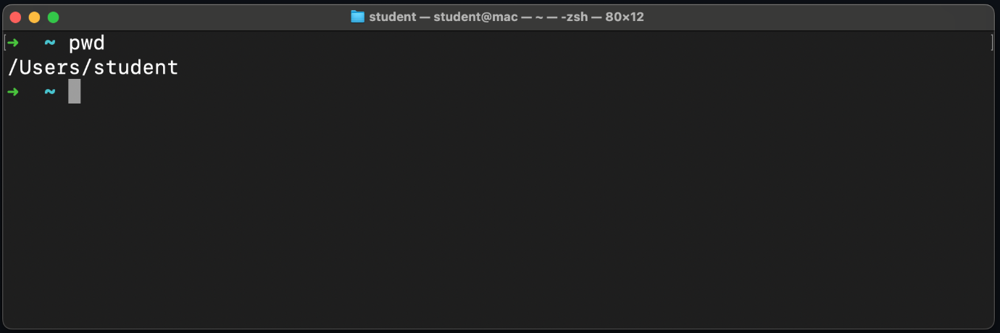

<br>

The screenshot above shows the path to the directory we're in right now (`/Users/student`). Your device likely shows something different, and that's expected. The home directory is where we start when we launch the terminal app.

Just like the Finder on a Mac, your CLI places you in a particular directory on your computer. pwd tells you where you’re currently located within your file system.

If we were using Finder in the GUI, we’d be able to see the files and directory that are present in this folder.

In a CLI, however, if we want to see the files and directory in our current location, we need to ask for that using another command.

## The List Command

To find out which files are in our current directory we use `ls`, short for “list.”, let's take a look around with the `ls` command. This command lists the contents of the directory we are currently in. In other words:

- The directories inside this directory
- The files inside this directory

Try it:

`ls`

Ta-da! We’re speaking in a language our computer understands. This command lists the directory’s contents, something similar to:

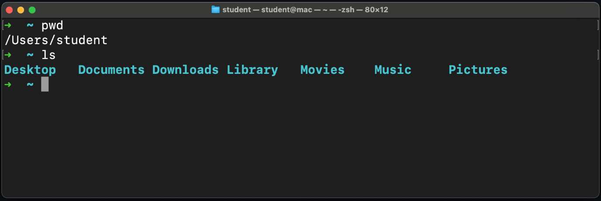

<br>

The output of this command may be different for you, but that's okay!  If you're using Windows, you may see something slightly different but will likely still have directories like `Desktop`, `Documents`, and `Downloads`.

The visual below might help demonstrate what's happening here. The student directory (the current working directory) has been highlighted in blue. From this directory, the `ls` command will display its direct children, shown in dark gray. The other files and directories still exist. They aren't shown by this command though.

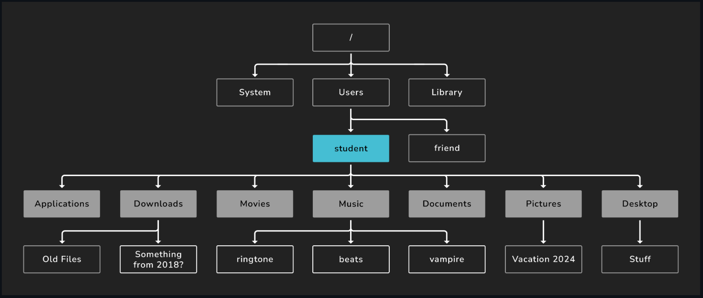

<br>

## A Caveat

This wouldn’t be an authentic language-learning experience if there weren’t a few caveats.

Operating systems and installed applications require lots of **hidden** files that aren’t always relevant to everyday users. But there will be cases where, as a programmer, you’ll want to view them.

We can do this with something called a **flag**, which is an additional command argument that modifies the behavior of the base command.

Flags start with the `-` prefix.

Type `ls -a`, which is the list command followed by the `-a` flag.

This means, “**Show me all of the files in my working directory and do not ignore entries that start with a period.**”

Your output may look different but should show previously hidden files, like so:

`~ ls -a`

```
funny_cat_picture.jpg
office_stuff
world_domination_checklist.txt
.bash_profile
.bash_history
```

## The Change Directory Command

To change directories, we’ll use `cd` — “change directory” — plus the name of the directory to which we want to change. Simple enough!

We just ran the `ls` command that gave us a list of valid destinations, including the `Music` directory. You might not have this directory. If not, pick another one.

Let's write and execute a command to change to that directory.

`cd Music`

In this line, `cd` is the command, and `Music` is the *command argument*. Notice the space between them.

`Music` is also a *relative path*. A *relative path* is the path from the perspective of the current directory. We'll use relative paths more often than absolute paths.

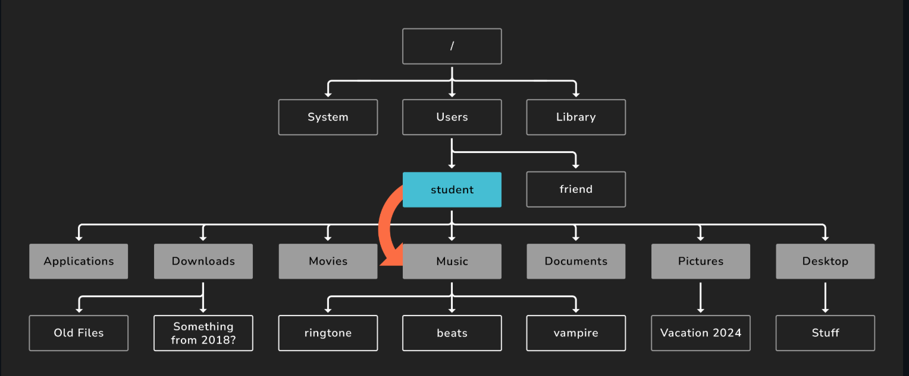

<br>

You could supply an absolute path as the argument if you wanted.

- 📚 A *relative path* is the path to a directory or file from the perspective of the current working directory. This contrasts from an *absolute path* which is written from the perspective of the *root* or `/` directory.

If we rerun `pwd`, we'll see that we're now in `/Users/student/Music` (or something similar).

- 🧠 Instead of typing `pwd` in the command line, you can find it from the previous commands you have run by hitting the up arrow on your keyboard. This cycles through all the previous commands you have executed.

Let's go back to the user home directory. We have a couple of options available to do this. Choose only one to write and execute.

- We could return directly to the user home using the `~` shortcut. Here's that command:

`cd ~`

- We can also use `..`, which represents the parent directory of the current directory. This method works because the `Music` directory is the child of the user home directory. Here's the command to do this:

`cd ..`

The dots imply “parent directory.”  In this situation, these commands have the same result - changing the current working directory to the user home directory.

## Creating Directories

Let's create a directory! We'll get some additional practice navigating the file system too.

### `mkdir`

The `mkdir` command is used to create directories. The `mkdir` command takes a command argument like the `cd` command did.

Ensure your prompt indicates that you're in the `~` directory. If you're not, run:

`cd ~`

Once you're there, let's try out the `mkdir` command:

`mkdir ga`

Running this command will create a `ga` directory! Let's move into that directory with the `cd` command.

This time, only type `cd g` into the command line, then hit the `Tab` key. This should autocomplete the rest of the line, and it should now say `cd ga`. Execute that command!

This is called tab completion, and it is the best.

- ♻ Repeatable pattern: Tab completion will let you do less typing and save time. It's also more precise than manually typing paths out because it will only complete valid commands and paths. It's also a great tool in VS Code when we start using it.

### 🎓 You Do

Create another directory of your choice and move into it.

## Creating Files

Let's create a file!

### `touch`

You should be in the directory that you just created.

The `touch` command works very similarly to the `mkdir` command, except instead of creating an empty directory, it creates an empty file. Files typically have a file extension like `.html` for HTML files or `.png` for PNG image files.

`touch file.txt`

The command creates a file with the `.txt` extension, representing a text file.

## Removing Files

Now that we’ve created a few files, let’s remove one using the `rm` command:

**Note:** Be careful when using `rm`. Unlike moving files to the trash or recycle bin, deleting files with `rm` removes them permanently!

`rm style.css`

We can verify its removal by typing `ls`, which should only return 

`index.html`.

## Deleting

We may have created more than we need; let's clean up some.

### 🎓 You Do

Delete the file and the directory that you just created.

- Use the `rm` command to delete the `file.txt` file. The syntax for the `rm` command is similar to the `touch` command, but it destroys instead of creates. **There is no trash to recover files from after they are deleted with this command, so use it carefully.**

- Navigate out of the current **directory** so you can delete it. Maybe return to the parent directory like we did earlier?

- Use the `rmdir` command to delete the directory you created in the **You Do** section earlier. This command works similarly to the `mkdir` command but will destroy instead of create like the rm command. This command will only delete empty directories.

After you've accomplished those tasks, create a directory structure that could be used if you sign up for a cohort.

In your code directory, create a `ga` directory to hold everything you do at General Assembly. Inside of this `ga` directory, make four more directories:

- `labs` - For all lab assignments.
- `lessons` - For all class lectures.
- `projects` - For any large projects done in a course.
- `sandbox` - For quick experimentation.

When you're done, you should be able to run the `ls` command in the `ga` directory and see something similar to the following:

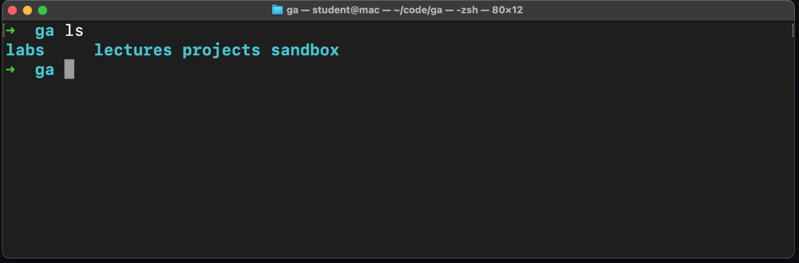

<br>

## Using the Command Line

<a href="https://generalassembly.wistia.com/medias/sjnhxrdelv"></a>

## Test Yourself!
# Where in the World?!

Time to try out command line on your own!

We’ve gone ahead and created a new directory for you called `world`. Download it [here](https://ga-instruction.s3.amazonaws.com/assets/tech/accessing-and-navigating-the-cli/World.zip).

When you double-click on the zip file, it will create a new directory named `world` next to it in your `Downloads` directory.

Now that you can picture where the file is located, open a terminal window.

Use the command line to do the following:

- Navigate into your `Downloads` directory.
- Move into the world directory from the `Downloads` directory.
- List the contents of the `world` directory.
- One of the six continents within the `world` directory contains a hidden file, `.carmen_sandiego.png`. Using only the command line, find out where in the world — i.e., where in the directory structure — this fugitive file is hidden.

## Hint...


<br>

If you weren't able to find the file, make sure you're using the `ls -a` command.

## Wrap up

In this lesson, you accessed your computer’s command line interface (CLI) and started using it to navigate your computer.

Like power tools, commands should be used only as directed. You are now speaking directly to your computer, and it’s possible to execute commands with unintended consequences if you type some seemingly random letters into your terminal.

If you stick to using commands as instructed in the pre-work or in class, you’ll be safe.

Check out this [cheat sheet](https://www.git-tower.com/blog/command-line-cheat-sheet/), there's resources out there to help you get familiar with the Command Line.

### Up Next...

We are going to chat about the Bootcamp Mindset.

<br>

<hr>
<a href="./assets/accessing-and-navigating-the-cli.pdf" target="_blank" download="accessing-and-navigating-the-cli.pdf" class="ant-btn" data-trackable="true" data-track-category="study guide" data-track-section="lesson page" data-track-action="download study guide"><span role="img" class="anticon"><svg viewBox="0 0 16 16" width="1em" height="1em" fill="currentColor" aria-hidden="true" focusable="false" class=""><g class="download_svg__nc-icon-wrapper"><path d="M8 12c.3 0 .5-.1.7-.3L14.4 6 13 4.6l-4 4V0H7v8.6l-4-4L1.6 6l5.7 5.7c.2.2.4.3.7.3z"></path><path data-color="color-2" d="M1 14h14v2H1z"></path></g></svg></span><span> Download Study Guide</span></a>

<br>
