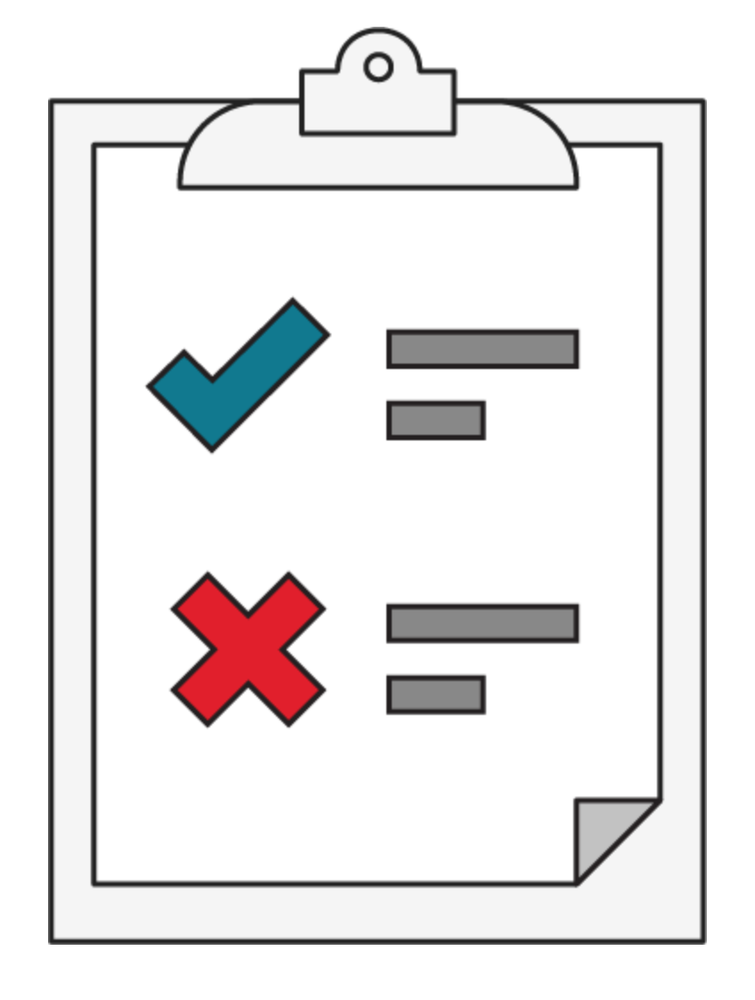
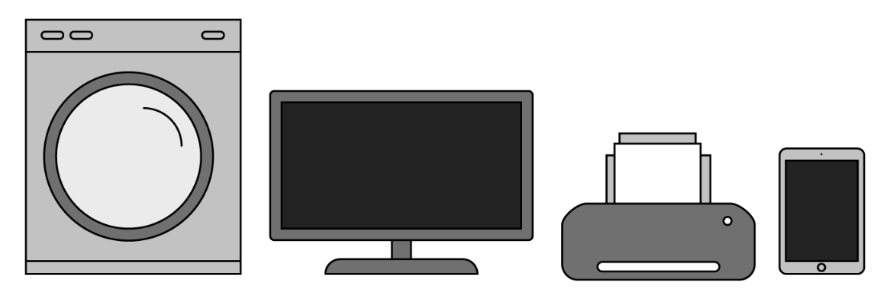
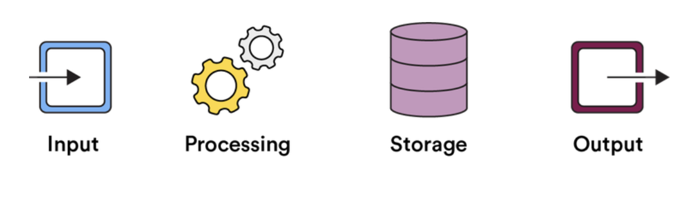

<h1>
  The Programmer's Tools
  How Computers Work
</h1>

## How Computers Work ( 20 min )

*author: [Roley Dallas](https://generalassemb.ly/instructors/riley-dallas/8760) | web developer and data scientist*

----
 

Goldilocks wanted a bed that was not too hard, or too soft, or too hot, or too cold. Like Goldilocks, you might want to find that value that’s right in the middle. But when you’re dealing with a large, complex data set, that can be more complicated than it sounds. In this lesson, we’ll dive into the statistics that will help you see the range of options and find where “center” actually is.

## Topics

- The History of Computing
- The Basics of How Computers Work

## Pop Quiz, Hot Shot

Take a quick glance around you and count up the number of computers you see in your space right now.

Once you’re done counting keep reading.

 

## Computers Run Everything Around Me

We guarantee that you’ve identified at least one computer — the device you’re currently using right now! Depending on the space you’re in, you might have noticed a bunch of others:

- The mobile device in your pocket.
- The phone on your desk.
- Your smart television.
- Your virtual home assistant (Hi, Alexa!).
- The ticket machine on the train you’re riding.
- Your microwave.

The fact of the matter is, computers are everywhere around us, but most of us have no idea how they work.

In this lesson, we’ll give you a quick introduction so you can better understand what makes these powerful and omnipresent tools tick.

 

### **Learning Objectives**

By the end of this lesson, you'll be able to:

- Define what a computer is and what it isn’t.
- Summarize the history of computing.
- Explain the basics of how computers work.

## What Is a Computer?

Humans have a history of designing tools to make things easier for themselves. These inventions started out pretty basic, like a wheel, and got more complicated over time, like a train that uses steam to power many wheels.

Eventually, we started needing help with tasks that weren’t so manual in nature, like solving encrypted messages and calculating large numbers.

These days, it’s hard to go about our daily lives without relying on a computer for help in some way.

## A Brief History of Computing

[TODO] - Video

### How Computers Work

Now that you understand a bit about how computers developed over time — from the difference machine, to punch cards, to your smartphone — let’s dive into how today’s computers actually work.

This diagram highlights the key components of a modern computing device. Let’s break these down and discover how they work together to help you FaceTime your parents. Which, by the way, you should really do more often. Seriously, call your parents.

 

## How Computers Work: Input

All computers provide a way to input information: Your mouse tracks your gestures to move your cursor, your mobile device reads your thumbprint on the home button to unlock, and your keyboard records your keystrokes so you can write a strongly worded review of your neighborhood café on Yelp.

Some inputs don’t require human intervention at all: Your fancy smart thermostat senses the air temperature in your home even when you’re not there, just like an earthquake sensor picks up minute shifts in the Earth’s crust that humans can’t feel.

Regardless of how the information is collected, every computer needs inputs in order to work.

 

### How Computers Work: Processing

Once a computer receives an input, it goes to work processing that information and doing something with it. Your computer processes inputs using a series of instructions, which we call **software**.

Because they can’t think for themselves (yet), computers can only process information in the ways we tell them to. That being said, they’re very good at following the instructions we provide.

However, computers don’t understand natural language like we do. In order to communicate instructions to a computer, these instructions must be written in code, also known as **programming languages**.

 

## How Computers Work: Storage

As computers process inputs based on these sets of instructions, they store the resulting information in memory until all of the processing is complete and ready to be sent out.

 

### How Computers Work: Output

What computers give back as output depends on the purpose for which they were designed. For instance, your smart thermostat outputs information that tells the air conditioning unit to start cooling.

Your personal computer or your mobile device outputs images, videos, text, sounds, etc.

Sometimes, the output of one computer might be the input for another, like when your coworker sends you a message via your office chat saying there are free donuts on the third floor. Good looking out, Karen!

 

## Putting It All Together

[TODO]- video

## Wrap up

Eager to learn more about the modern computer’s storied past?

Check out CNN’s interactive [highlight reel](https://money.cnn.com/interactive/technology/computing-power-timeline/) or this thorough [timeline](https://www.computerhistory.org/timeline/) from the Computer History Museum.

### Up Next...

We are going to check out Layers of Abstraction.