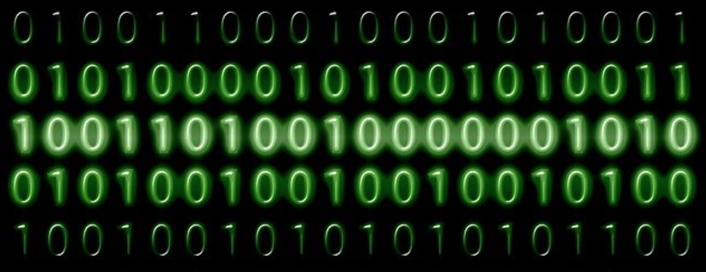
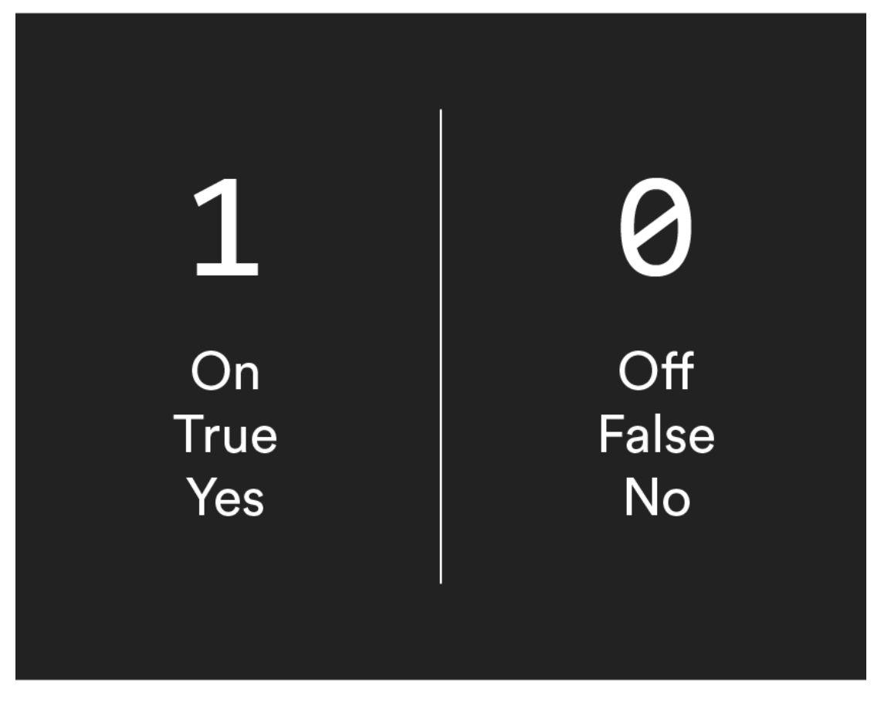
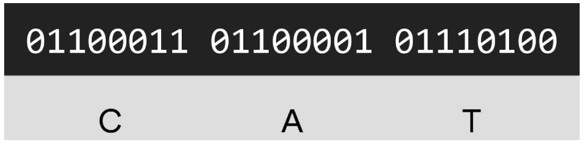
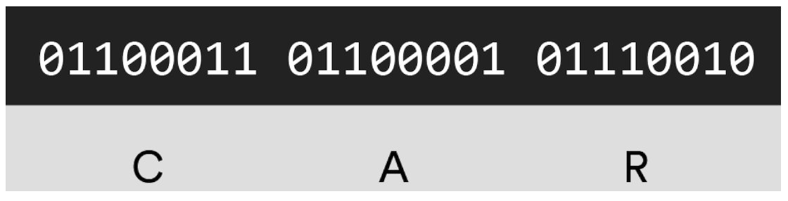
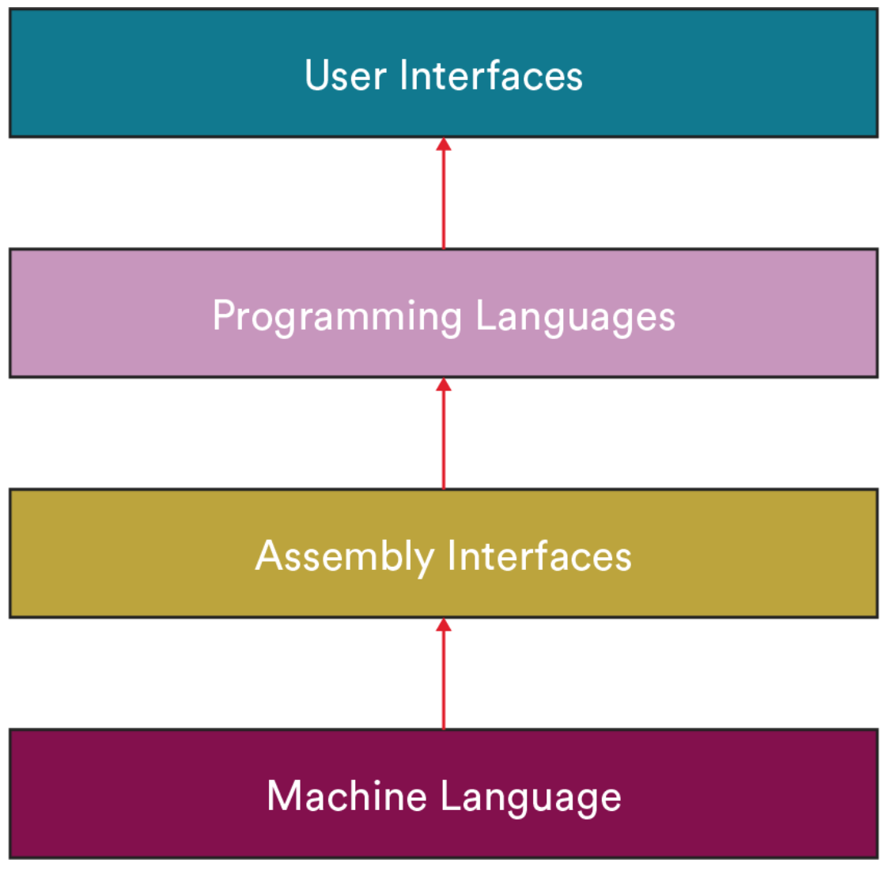
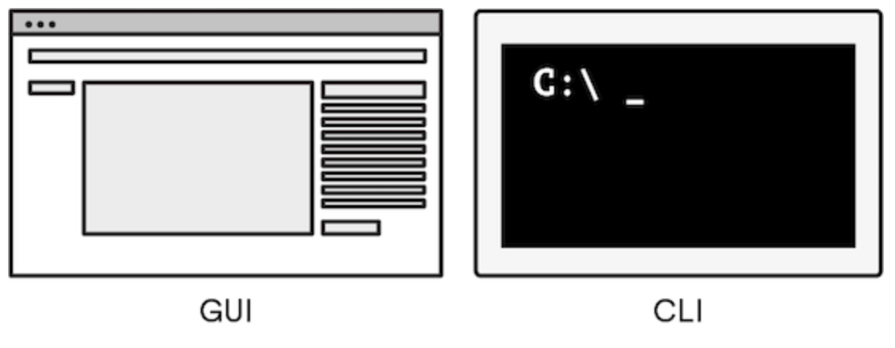
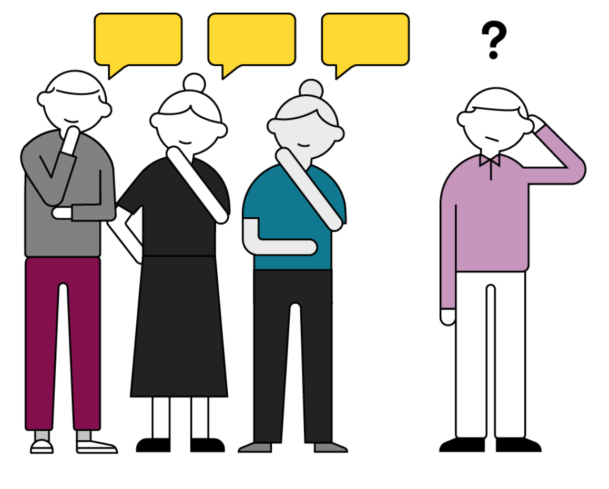

<h1>
  The Programmer's Tools
  Introducing the Layers of Abstraction
</h1>

## Introducing the Layers of Abstraction ( 15 min )

*author: [Greg Gordeau](https://www.linkedin.com/in/godreau/) : software developer*

----
 

01001000 01100101 01101100 01101100 01101111 00100000 01100001 01101110 01100100 00100000 01110111 01100101 01101100 01100011 01101111 01101101 01100101 00100000 01110100 01101111 010 Wait... don’t go! Sorry about that. No, you are not in the matrix. We were just saying hello in binary. In this lesson, you’ll learn why we don’t have to know how to speak binary to use computers. Thank goodness!

## Topics

- Levels of Abstraction

## Why We’re Here

**Binary** is the language that all computers speak at their most basic level. It’s a *machine language* that’s generally unreadable by humans. Luckily for all of us, we don’t have to start communicating in 1s and 0s in order to use computers or even program them.

 

### **Learning Objectives**

By the end of this lesson, you'll be able to:

- Define abstraction.
- Summarize how layers of abstraction allow programs and users to interact with computers in ways that are more intuitive to humans.
- Differentiate between a graphical user interface (GUI) and a command line interface (CLI).

## Why 1s and 0s?

Initially, computers were huge room-sized machines that used vacuum tubes and electromechanical relays to represent logic states.

Humans input conditionals — true/false statements — and the tubes took care of the rest.

 

## Machine Language

As we mentioned, the “language” the computer speaks to itself is a **machine language** called binary.

For example, in binary, the word “cat” would be represented as the following...

 

...whereas the word “car” would be represented by this:

 

## 1s and 0s Today

Modern computers work in exactly the same way: They still speak binary. Luckily, developers, inventors, and innovators have introduced levels of abstraction to separate us lowly humans from the work of decoding these 1s and 0s.

## Levels of Abstraction

Computer scientists study abstraction for a living, and you can certainly go into a great deal of depth understanding what it is, what it means, and how it works.

For our purposes, we’ll explore how hardware and software work together to allow people to interact with computers in intuitive ways through layers of abstraction.

So far, we’ve covered machine language — again, that’s the series of 1s and 0s that computers understand.

 

## Level 1: Assembly, Generally

The next step away from machine language is **assembly**.

Assembly is a sequence of instructions written by a programmer, which is then translated by an *assembler* into the 1s and 0s that computer hardware can recognize.

## Level 2: Programming Languages

Does everybody actually write code in assembly? Is it necessary to control operations at the hardware level?

The answer is that it depends, but, usually no.

Nowadays, most programmers do their work by writing code in **programming languages** that are more declarative (i.e., telling the computer what you want) and less imperative (i.e., telling the computer how you want to do it).

Developers and programmers can choose from thousands of programming languages that are easier to read and write than assembly languages, including C++, Java, JavaScript, and Python.

## Level 3: User Interfaces

All computers speak to the world through an API, an **application programming interface**.

In the case of the earliest computers, such as the [difference engine](https://www.computerhistory.org/babbage/), the API was a hand crank and the output was achieved through a series of mechanical wheels on the device that the operator would need to interpret.

Modern computers and most programs communicate with the world through a graphical user interface (GUI, pronounced like “gooey”). You as the user input information using a keyboard and mouse, and the result is displayed on the screen. A GUI is an API that’s intended to be used by human beings.

By contrast, the **command line interface** (CLI) — also called a **terminal** — is a software application that interfaces with program APIs more directly, using text instead of graphics.

As a general rule of thumb, the *prettier* your screen, the greater your level of abstraction. The CLI is extremely utilitarian, with no pictures, no colors, just text.

 

### Wrap Up

Abstraction is kind of like a game of telephone. You can think of each level of abstraction as another person passing the original message down the line.

As we get further away from binary, the computer’s true language, we lose some functionality with each step.

Most of us don’t miss that functionality and, in fact, don’t even know what we’re missing. For computer experts like software engineers, computer scientists, and programmers, however, that functionality is crucial and dearly missed. This is why they often prefer to operate a bit closer to the computer’s original language.

 

You should now be able to:

- Define abstraction.
- Summarize how layers of abstraction allow programs and users to interact with computers in ways that are more intuitive to humans.
- Compare the command line and a GUI.

Now, go have some fun writing messages in binary with this [handy decoder](https://cryptii.com/pipes/binary-decoder).

## Up Next...

We are going to check out Accessing and Navigating the Command Line Interface.

 
