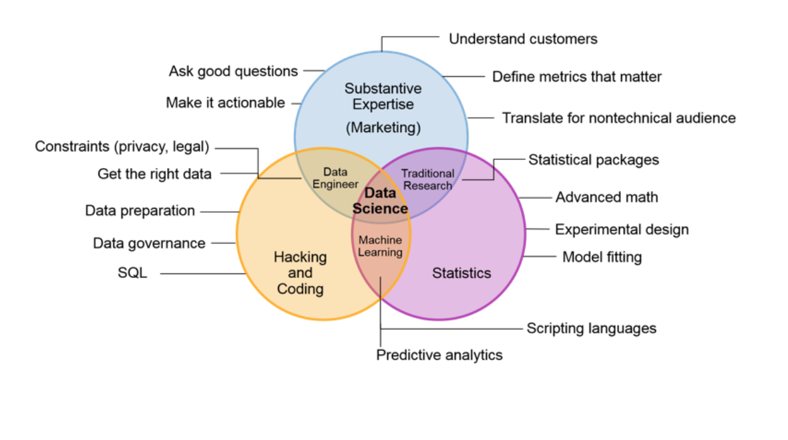
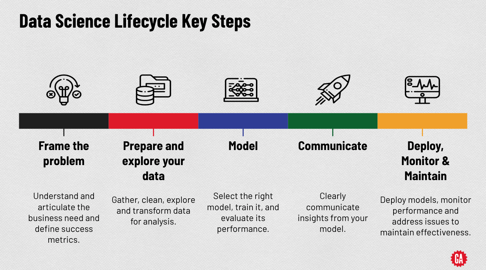
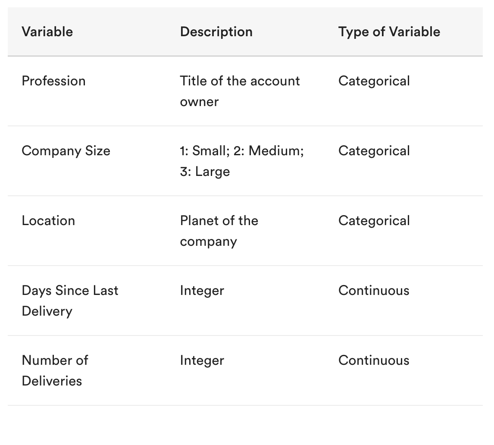

<h1>
  Data Science Prework
  Welcome
</h1>

## Welcome to Data Science!

We couldn’t be more excited to join you in your journey toward a new career. By incorporating feedback from hundreds of students that have come before you, we’ve focused on making this course as worthwhile as possible. You have exciting work ahead, but it’s going to take energy, time, and collaboration.

GA’s Data Science program will give you a deep dive into the world of data science and its many applications.

You’ll analyze massive data sets and predict what happens next through predictive modeling and pattern recognition. By the end of this course, you’ll have a polished portfolio of work that showcases your ability to distill insights with machine learning in a way that is impactful to key stakeholders.

We’ve prepared a pre-course learning experience to help you hit the ground running, because once you get into the classroom, things will move quickly. Let’s see what’s in store!

## General Assembly's Educational Values

First things first: Our educational values. These are General Assembly's guiding principles to how we approach education, and ultimately to how instructors support our student’s learning experiences.

- Career-Focused:  GA students come to us because they’re looking for a change in their professional lives. Live this value by setting clear, high expectations for yourself and your peers as you would on the job. Practice professionalism, be proactive, and take pride in your work.

- Learn with Empathy:  We are proud of the diversity of the GA community and commit to creating a safe and inclusive environment for all staff and learners. Our students and staff come to GA from a variety of backgrounds with many different backstories, interests, and experiences. When working with others lead with empathy, put yourself in their shoes, and be open to different perspectives throughout your learning experience.

- Data-Driven Instruction:  Ultimately, we are here to foster student growth and development during their time at GA. As instructors and support staff, we use data in many different forms to help reach each student effectively.

- Active Learning:  GA students are empowered to take ownership of their own learning. As students you hold the key to your success and your instructors and support staff are here to facilitate your learning and discovery.

- Keep Growing:  You came to GA because you want to grow! To live this value, always up your ante, maintain high levels of professionalism and effort, and seek out resources that will push you. Get comfortable with the uncomfortable, knowing that you are learning and growing along the way!

## The World of Data Science

## How to Succeed

Chances are, you’re here at least in part because you’re looking for change and growth. This only happens with effort. This program, in particular, will take some hustle and risk. We’ll be throwing a lot at you, and the pace of the course will be brisk.

Your ability to succeed in this program is not determined by background but by your ability to learn new things quickly. Much of this will be facilitated through projects, but you may have to start being more inquisitive, more analytical, and rethink how you learn. Buckle up!

If you're taking one of our Bootcamps, then watch the videos at the bottom of this page on getting the most from your experience and some words of advice on learning.

----
# What Is Data Science?

*author: [Haley Boyan](http://linkedin.com/in/hboyan) : data scientist*

### Topics

- An Introduction to Data Science
- Data Science in the Real World
- Ongoing Developments in the Data Science Field

## Living in a Data Science World

Have you ever had a shopping website suggest a product to you? What about a credit card put on hold because of fraud detection? How many times a day do you do a Google search?

 

There’s no need to welcome you to the world of data science — you’re already living in it!

In this unit, we will demystify this expansive field.

### Learning Objectives

By the end of this lesson, you'll be able to:

- Define the field of data science.
- Identify examples of data science in various industries and use cases.
- Survey components of the data science field and discuss whether they are stable or developing.

## What Is Data Science?

In general, data science is defined as the practice of extracting insights from data to guide decision-making. To achieve this, data scientists leverage a combination of computer skills, statistical understanding, and subject matter expertise.

Put plainly, it’s the application of scientific techniques to data to solve problems.

 

## Now Hiring: "Data Something-Ist"

Data scientists are not always referred to by the same title. In fact, there are dozens out there. Here are a few common roles that may use data science techniques:

- Data scientist.
- Data analyst.
- Business intelligence analyst.
- Data visualization expert.
- Researcher.
- Engineer.
- Statistician.
- Developer.

## So, What Do Data Scientists Actually Do?

First off, it’s important to understand the skills involved. Data scientists commonly combine:

- Business intelligence.
- Machine learning modeling.
- Database design/big data.
- Applied math and statistics.
- Programming.
- Study design.

## Who Does What?

Different data science roles require different skill sets. For instance, skills used by researchers aren’t the same as those used by developers.

The skills that General Assembly Data Science students learn align most closely with those used by data scientists on the job. Students gain knowledge to apply to a wide range of roles and projects, focusing on the foundations of stats, programming, and machine learning.

 

## How Do Data Scientists Solve Problems?

Most data scientists apply a version of the scientific method to analyze an issue. At General Assembly, we call this the **Data Science Lifecycle**, and we’ve broken it down into a series of steps.

1. **Frame the Problem**: Understand and articulate the business need and define success metrics.

2. **Prepare and Explore Your Data**: Gather, clean, explore and transform data for analysis.

3. **Model**: Select the right model, train it, and evaluate its performance.

4. **Communicate**: Clearly communicate insights from your model.

5. **Deploy, Monitor and Maintain**: Deploy models, monitor performance and address issues to maintain effectiveness.

 

## Reliable and Reproducible

Our problem-solving framework helps produce results that are **reliable** (so findings are more accurate) and **reproducible** (so that others can follow the same steps and achieve the same results).

Note that, depending on the problem you’re trying to solve, the Data Science Lifecycle will not always be linear. You may have to repeat some steps before drawing any conclusions!

We’ll explore these steps through an example project in the following sectoins.

## How About an Example?

Here’s a scenario:

Global shipping company Planetary Express has hired you to determine how likely users of the service are to become repeat customers. In your data arsenal, you have the following:

- Customer demographic data from 2013 to 2017 (profession, company size, location).
- Previous delivery data for these same customers (days since last delivery, total number of deliveries).

## Step 1: Framing Our Problem

In Step 1, we **frame** our problem. Our goal is to develop a clear hypothesis for our analysis.

We might begin by asking questions like:

- Are previous Planetary Express customers likely to request a repeat delivery?
- What factors are likely to influence a customer’s decision to reuse Planetary Express for delivery?

 

## Step 2: Preparing and Exploring Our Data

In Step 2, we **prepare** our data. To start, we’ll want to select and import the data we intend to use. We might do this by asking a series of questions:

- What data are provided, if any?
- Does this data describe the problems we’re trying to solve?
- Are there enough data points to adequately explore the issue?
- Is this data set trustworthy? How was it collected?
- Do we need to go out and collect more data?
- If so, where should we collect additional data?

Solving problems with data may require you to work with a number of different data sources. These include:

- Structured and unstructured data from the web (e.g., Google Analytics, HTML).
- Data from files (e.g., CSV, XML, TXT, JSON).
- Data from pre-existing databases (e.g., SQL, NoSQL, AWS).

 

To complete Step 2 and finish preparing our Planetary Express data, we’ll have to:

- Select relevant data.
- Import this data.
- Explore and verify our data.
- Clean our data, when necessary (Hint: It’s always necessary).

We have the following Planetary Express data:

- Demographic information (profession, company size, location).
- Previous delivery data (days since last delivery, total number of deliveries).

So, what do we need to do next?

## Step 2: Preparing and Exploring Our Data (Cont.)

If you guessed, “Figure out a way to load our data and take a look at it,” you’d be right! There are many ways to do this in Python (a back-end programming language). Let’s skip to the next step and begin exploring our data.

Our goal is to verify the quality of the data set we’ve been given so that we can figure out if we can use it to answer our questions. We might begin by exploring any source documentation provided with our data. Let’s assume we’ve been given a **data dictionary** that describes the content and types of data in our tables.

Here’s an example that lists the variable, description, and type of variables we’ve been given:

 

OK, so we’ve got some great data, we’ve validated the set, and we’re ready to dive in.

Wait, is that a missing field? And why are some of these numbers incorrectly labeled?

Looks like we have some cleaning to do.

Whether you’ve collected your own data or are working with data prepared by others, you’ll almost *always* need to devote some energy to cleaning.

## Step 2: Preparing and Exploring Our Data (Cont.)

Data scientists frequently joke that they spend about 80 percent of their time cleaning data and only 20 percent actually creating predictive models. In other words, *data cleaning is a fact of life*.

Data cleaning methods include, but are not exclusive to:

- Format column values.
- Differentiate between qualitative and quantitative data.
- Remove unnecessary features.
- Integrate multiple data sources.
- Address missing values.
- Choose a data sampling methodology.
- Sample your data.
- Create columns derived from our data (e.g., feature engineering).

## Step 3: Modeling Our Data

Let’s assume we’ve finished up and our data set is now squeaky clean. Bravo! Time to move on.

For Step 3, we’ll **analyze** our data. We might do things like:

- Structure, segment, or isolate parts of our data.
- Visualize our data using various methods.
- Calculate and compare our selections.

Depending on the problem we’re trying to solve (and the type of data we’re working with), our analysis could take many different forms. When in doubt, think back to your original goals in Step 1: What is your hypothesis? What are you trying to prove or measure from this data?

To do this, you might start by calculating some basic statistics or visualizing relationships between specific variables.

 

## Step 3: Modeling Our Data (Cont.)

Once we’ve visualized and analyzed our data, we’ll be able to **interpret** it. But, what does that mean?

In Step 4, we’ll use our analysis to answer our hypothesis and then use this answer to make predictions about future data. This allows us to create meaningful, real-world recommendations.

How does this work? We might:

1. Recall our Planetary Express hypothesis.
2. Review our prior visualizations and calculations.
3. Create a model that demonstrates how our analysis answers our original hypothesis.
4. Test this model on a sample set of new data to see if it continues to hold true.
5. Refine our model until we’re confident that we can make recommendations from it.

Our hypothesis from Step 1 should guide our approach and analysis in Steps 2 and 3. In Step 4, our goal is to create a general model that interprets our data and resolves our hypothesis. Once we’ve tested this model on new data, we’ll be able to use it to make predictions and justify future decisions.

You may be thinking, “Is it really that simple?”

Yes and no. We’ve simplified this process a bit; selecting and building models is both an art and a science. For one thing, there are *many* different types of models and approaches to choose from.

However, most data practitioners don’t memorize all of them — they merely learn to associate certain kinds of problems with certain kinds of models. When they encounter new problems, they do what any of us do: [They look them up](https://datascience.stackexchange.com/)!

General Assembly’s data science training helps students learn about a variety of methods that can be used to solve more than 70 percent of data problems people encounter in the field, including regression, classification, k-nearest neighbors, clustering, and more!

## Step 4: Communicating Our Findings

Once you’ve successfully built a model that can interpret your data and help justify real-world recommendations, what next?

You tell someone!

In Step 5, it’s time to **communicate** our results and recommendations to an audience of stakeholders. Who needs to be informed? Who needs to be persuaded? Who needs to be told what to do?

In our Planetary Express example, this might mean informing the board about our findings and suggesting that our team take immediate action to resolve future issues.

 

No matter how brilliant your model is or how illuminating your findings are, they won’t matter if no one listens. You’ll need to help your audience understand your process, care about your results, and persuade them to take any next steps.

In other words, presenting solutions with data involves many of the same considerations as any other field. You’ll want to do things like:

- Consider your audience.
- Create powerful visuals.
- Tell a meaningful story.
- Practice your presentation beforehand.
- Be prepared to answer questions.

Your goal in Step 5 is to share your information and inspire action!

How do you do this, exactly? What does a compelling data-driven presentation look like?

A few key components to consider, include:

- Summarizing your findings.
- Labeling all plots and visualizations.
- Restating your hypothesis and initial assumptions.
- Describing your data and process.
- Explaining your model’s strengths and limitations.
- Providing an appropriate degree of disclosure for your audience (especially when dealing with proprietary data or sensitive user information).

## Step 5: Deploying, Monitoring & Maintaining Our Model

Now that you’ve built a model and got buy-in that it should be used, you need to use it with real data.

Step 5 involves implementing the data science solution in a real-world environment, continuously monitoring its performance, and maintaining its effectiveness over time.

This includes addressing any issues that arise, updating the model with new data patterns, and ensuring the solution continues to meet business needs.

In our Planetary Express example, this might mean that we can identify in real-time whether a user is likely to become a repeat customer at the point they are booking in a shipping order, and we can then offer different products for those who are likely compared with those who are not likely to repeat.

 

## Off We Go!

There you have it — General Assembly’s Data Science Lifecycle at a high level. This problem-solving framework will serve as your guide throughout our programs (and your career).

 

# Are you taking one of our Bootcamps?
Then watch these videos on getting the most from your experience and some words of advice.

## Getting the Most From Your Experience

## Some Words of Advice

 

### Up Next...

We are going to dive into Python, the free and simple programming language that a Data Scientist must know.  Let's get started with our Python Prework!

 

<a href="./assets/what-is-data-science.pdf" target="_blank" download="what-is-data-science.pdf" class="ant-btn" data-trackable="true" data-track-category="study guide" data-track-section="lesson page" data-track-action="download study guide"><svg viewBox="0 0 16 16" width="1em" height="1em" fill="currentColor" aria-hidden="true" focusable="false" class=""><g class="download_svg__nc-icon-wrapper"><path d="M8 12c.3 0 .5-.1.7-.3L14.4 6 13 4.6l-4 4V0H7v8.6l-4-4L1.6 6l5.7 5.7c.2.2.4.3.7.3z"></path><path data-color="color-2" d="M1 14h14v2H1z"></path></g></svg> Download Study Guide</a>

 
